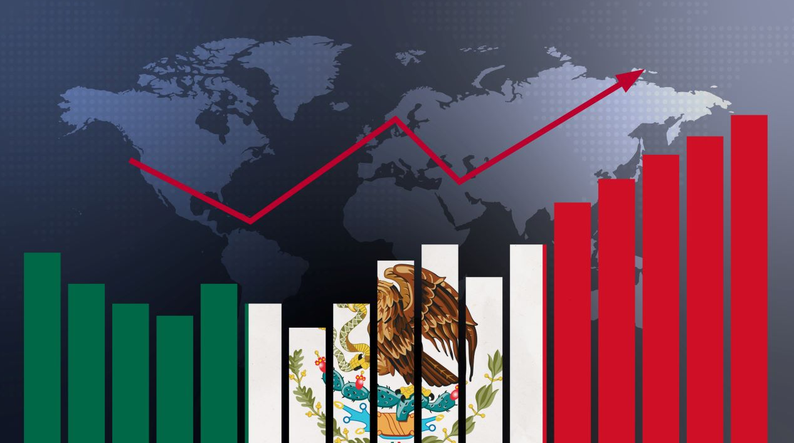
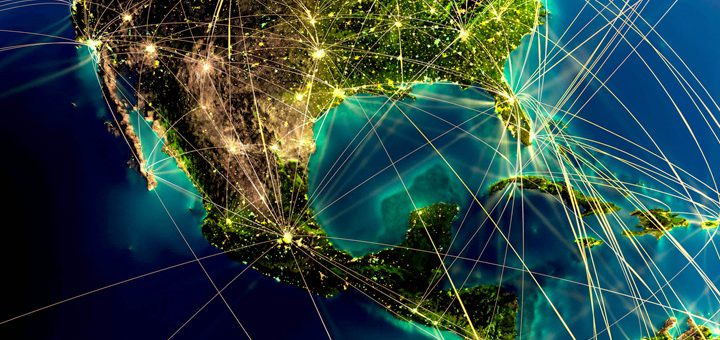

# Economic Key Performance Indicators : Understanding Mexico's economy at a glance

## Overview

This project aims to provide an in-depth analysis of key economic performance indicators to understand Mexico's economy from 2014 to 2024. By examining various factors such as Gross domestic product (GDP), Foreign Direct Investment (FDI) , international purchases, foreign trade, and trade value growth, we can gain a comprehensive view of the economic landscape in Mexico. Our research addresses critical aspects of economic development, identifying trends and impacts over the past decade.

### Topics Covered:

**Mexico's Gross domestic product (GDP):**
Mexico's GDP has shown significant fluctuations over the past decade. The industry sector consistently contributing the highest value to Mexico’s GDP is the manufacturing sector. This sector includes automotive, electronics, and other high-value manufacturing industries. In terms of growth, the services sector, particularly tourism and IT services, has seen substantial expansion, contributing increasingly to the nation's GDP.

**Foreign Direct Investment (FDI):**
Foreign Direct Investment in Mexico has been predominantly driven by countries like the United States, Canada, and Spain. These investments are mainly concentrated in the manufacturing and energy sectors, reflecting Mexico's strategic importance in these industries. The automotive industry, in particular, has attracted substantial FDI, boosting industrial growth and technological advancements.

**International Purchases:**
Mexico’s international purchases have been dominated by imports from countries such as the United States, China, and Germany. Over the last decade, the top imports include machinery, electronics, vehicles, and medical equipment. This trade dynamic underscores Mexico's reliance on these key economies for critical goods and technological products.

**Foreign Trade:**
Foreign trade is a vital component of Mexico's economy, with significant contributions from various states. The top 15 states with major foreign trade activities include Mexico City, Nuevo León, and Jalisco, among others. These states have robust industrial bases and strategic locations that facilitate extensive trade operations, enhancing their economic stature.

**Trade Value Growth:**
Trade value growth in Mexico has experienced shifts due to global events, including the COVID-19 pandemic. The pandemic severely impacted the automotive and aerospace sectors, leading to a temporary decline in exports. However, sectors such as pharmaceuticals and electronics have shown resilience and significant growth, adapting to the changing global demands.

### Conclusion
Our analysis highlights the dynamic nature of Mexico's economy, driven by various sectors and influenced by global economic trends. Understanding these key performance indicators provides valuable insights into the strengths and challenges facing Mexico's economic development from 2014 to 2024.

